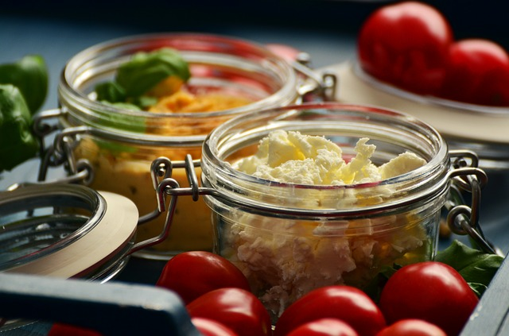

# Delicious Recipes

> Collection of quick and tasty recipes.

**_Sites:_**
* [**Jamie Oliver**](http://www.jamieoliver.com/)
* [**Neill Anthony**](http://www.neillanthony.com/) / private chef

**_Technique:_**
* [**How To Master 5 Basic Cooking Skills**](https://www.youtube.com/watch?v=ZJy1ajvMU1k) / Gordon Ramsay

## Contents

> [*Chicken*](#chicken), [*Desserts*](#desserts), [*Eggs*](#eggs), [*Pastas*](#pastas), [*Spicy*](#spicy), [*Veggies*](#veggies)

## Chicken
* [**Garlic Roasted Drumsticks**](http://busycooks.about.com/od/chickendrumstickrecipes/r/Garlic-Roasted-Drumsticks.htm)
* [**Lemon Chicken Stir-Fry**](http://www.eatingwell.com/recipe/249882/lemon-chicken-stir-fry/)

## Desserts
* [**Creamy Rice Pudding**](http://allrecipes.com/recipe/24059/creamy-rice-pudding/)

## Eggs
* [**How To Make Perfect Scrambled Eggs**](http://www.jamieoliver.com/news-and-features/features/how-to-make-perfect-scrambled-eggs/) / [*video*](https://www.youtube.com/watch?v=s9r-CxnCXkg) / Jamie Oliver
* [**Gordon Ramsay's Scrambled Eggs**](https://www.youtube.com/watch?v=PUP7U5vTMM0) / video
* [**Perfect Scrambled Eggs**](http://www.bbcgoodfood.com/recipes/1720/perfect-scrambled-eggs) / BBC Good Food

## Pastas
* [**Bacon & Cheese Macaroni**](http://www.food24.com/Recipes-and-Menus/Easy-Weekday-Meals/Bacon-and-cheese-macaroni-20130322)
* [**How To Cook Pasta**](http://busycooks.about.com/cs/pastarice/ht/cookpasta.htm)
* [**Tomato Pasta Sauce**](http://www.nhs.uk/Livewell/healthy-recipes/Pages/tomato-pasta-sauce.aspx)

## Spicy
* [**Curried Red Lentils**](http://www.food.com/recipe/curried-red-lentils-38693)
* [**Curry Beans**](https://github.com/shnbwmn/delicious-recipes/blob/master/Curry-Beans.md) / local South African Muslim recipe

## Veggies
* [**Baked Acorn Squash**](http://www.foodnetwork.com/recipes/baked-acorn-squash-recipe.html)
* [**Dauphinoise Potatoes**](http://www.bbc.co.uk/food/recipes/dauphinoisepotatoes_90205)
* [**Glazed Carrots**](http://southernfood.about.com/od/carrots/r/bl61012a.htm) / [*alt*](http://www.dvo.com/newsletter/weekly/2013/03-29-642/recipe_53.html)
* [**Stuffed Bell Peppers**](http://www.foodnetwork.com/recipes/ree-drummond/stuffed-bell-peppers.html) / [*alt*](http://www.foodiecrush.com/stuffed-bell-peppers-recipe/)

## License

To the extent possible under law, Shane Bowman has waived all copyright and related or neighbouring rights to this work.

